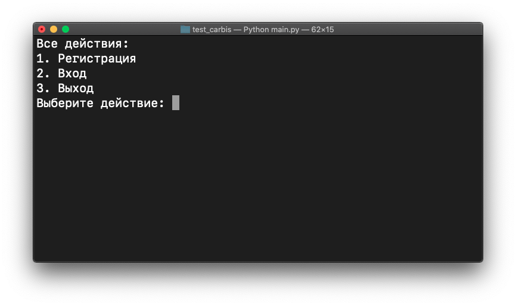
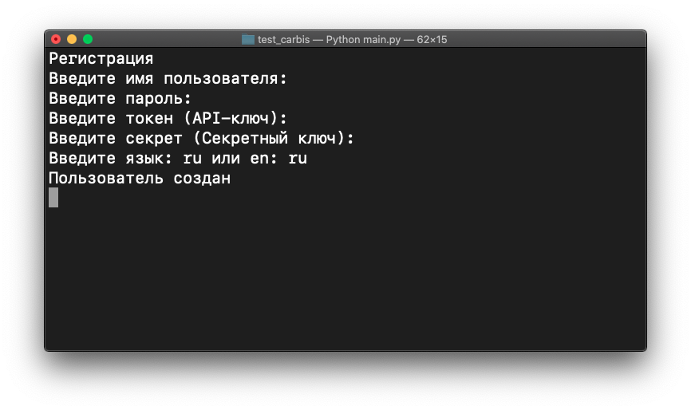
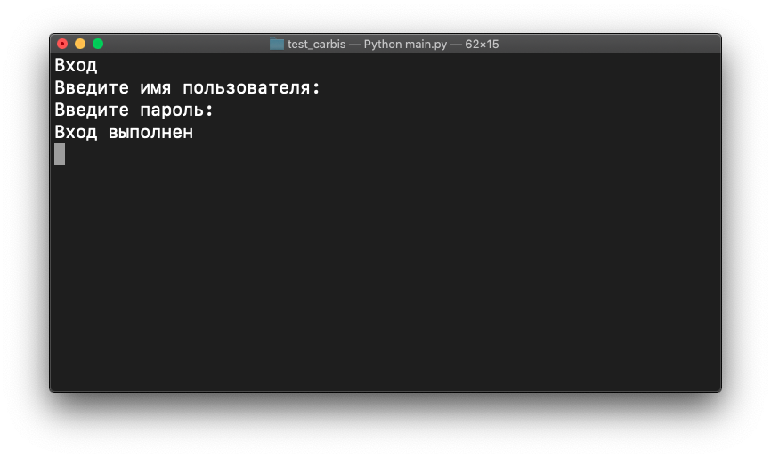
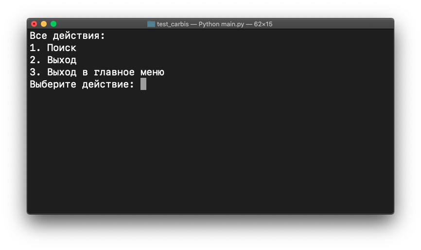
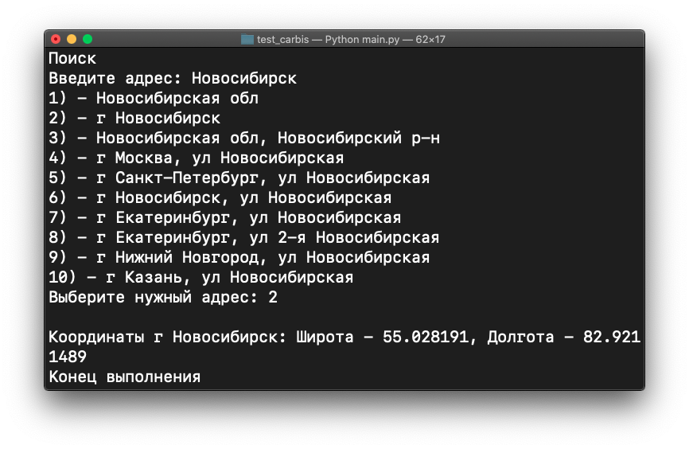

# Test_carbis
Программа для поиска адресов и их координат

# Установка программы

1. Клонируйте репозиторий
```
https://github.com/vovatengu/test_carbis.git
```
2. Войдите в папку
```
cd test_carbis
```
2. Создайте виртуальное окружение
```
python -m venv carbis
source carbis/bin/activate 
```
3. Установите зависимости
```
pip install -r requirements.txt
```

4. Запустите приложениe
```
python .\app.py
```

# Пример работы программы
При запуске появляется стартовое меню с выбором.



При первом запуске программы нужно зарегистрироватьсяя.



Далле возвратится в стартовое меню. Из него нажимаем кнопку для входа.



Появляется меню действий для авторизованного пользователя.



В поиске выполняем действия с выбором поэтапно. 
После выведет, что выполение закончилось и вернётся в предыдущее меню для дальнейщих действий.



# Разработка программы 

В ходе разработки использовались паттерны объектно-ориентированного программирования: 
```
Singltone
State
```
